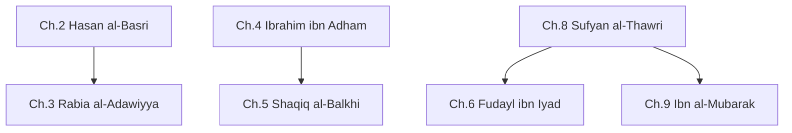
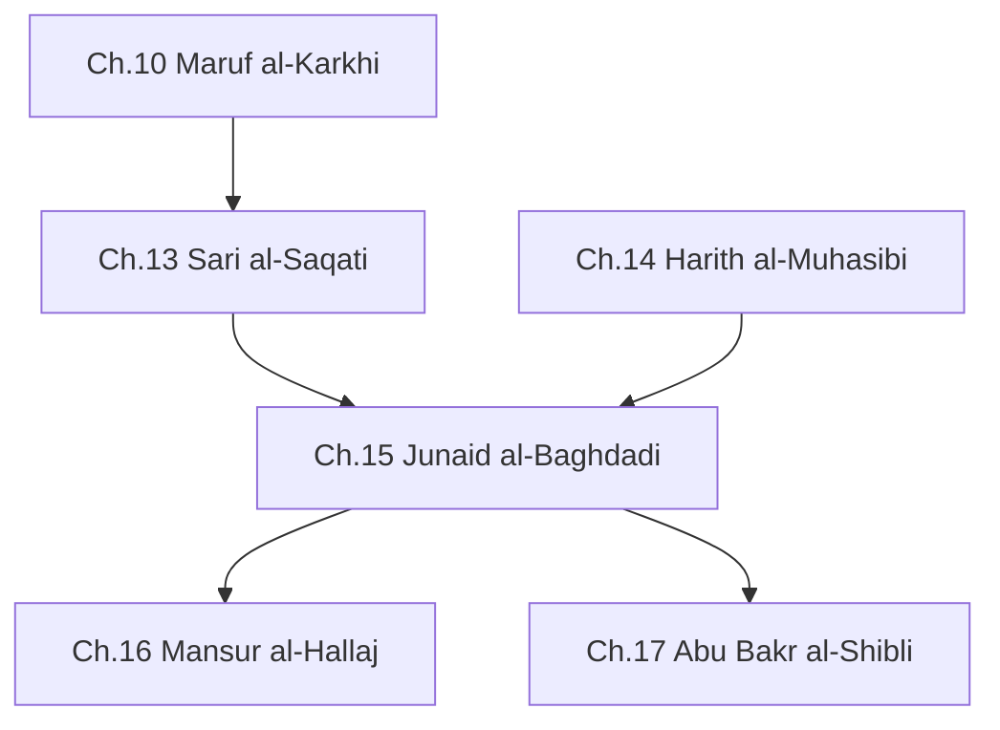
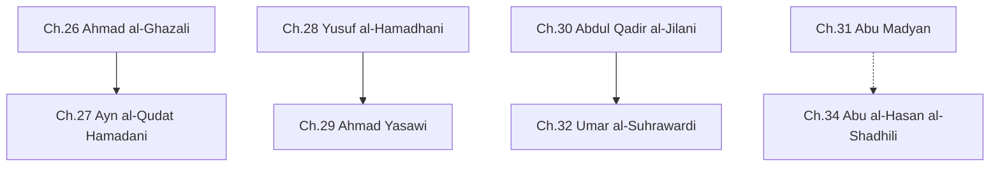
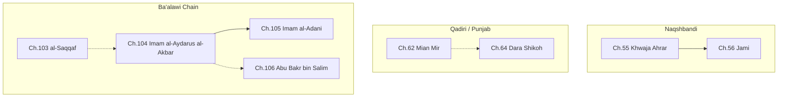
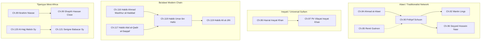

# Relationship Graphs by Era

Arrows (→) indicate direct teacher → student transmission. Dashed arrows (- ->) indicate indirect transmission through an unnamed intermediary, Uwaysi/visionary connection, or strong intellectual influence. Cross-era connections are noted in text below each diagram.

---

## Part One: Seeds of Tasawwuf (1st–2nd Century AH, Ch. 1–9)

**Cross-era outgoing:** Ch.7 Dawud al-Tai → Ch.10 Maruf al-Karkhi (Part 2). Ch.6 Fudayl ibn Iyad → Ch.13 Sari al-Saqati (Part 2).

---

## Part Two: Crystallization of Sufi Thought (3rd–4th Century AH, Ch. 10–20)

**Incoming:** Ch.7 Dawud al-Tai (P1) → Ch.10. Ch.6 Fudayl (P1) → Ch.13.
**Cross-era outgoing:** Ch.15 Junaid → Ch.35 Ahmad al-Rifa'i (Part 3, through the chain).

---

## Part Three: Age of Systematization (5th–6th Century AH, Ch. 21–35)

**Note:** Ch.31 Abu Madyan -.-> Ch.34 al-Shadhili is through Abd al-Salam ibn Mashish (unnamed intermediary in the chain).
**Incoming:** Ch.15 Junaid (P2) → Ch.35 al-Rifa'i (through chain).
**Cross-era outgoing:** Ch.33 Kubra → Ch.36 Attar (P4, via Majd al-Din al-Baghdadi). Ch.32 Suhrawardi → Ch.40 Bahauddin Zakariya (P4). Ch.28 Hamadhani → Ch.49 Abdul Khaliq al-Ghujduwani (P4). Ch.34 al-Shadhili chain → Ch.45 al-Busiri and Ch.47 Ibn Ata'illah (P4, through Abu al-Abbas al-Mursi).

---

## Part Four: Golden Age (7th–8th Century AH, Ch. 36–50, 101–102)

```mermaid
graph TD
    subgraph Chishti Chain
        C39["Ch.39 Moinuddin Chishti"] --> C42["Ch.42 Qutbuddin Kaki"]
        C42 --> C44["Ch.44 Baba Farid"]
        C44 --> C46["Ch.46 Nizamuddin Auliya"]
        C46 --> C48["Ch.48 Amir Khusraw"]
    end

    subgraph Naqshbandi Roots
        C49["Ch.49 Abdul Khaliq al-Ghujduwani"] -.-> C50["Ch.50 Baha al-Din Naqshband"]
    end

    subgraph Akbari
        C37["Ch.37 Ibn Arabi"] --> C43["Ch.43 Sadr al-Din Qunawi"]
    end

    subgraph Ba'alawi Origins
        C101["Ch.101 al-Faqih al-Muqaddam"] -.-> C102["Ch.102 Umar al-Mihdar"]
    end
```

**Note:** Ch.49 -.-> Ch.50 is an Uwaysi/visionary connection spanning two centuries.
**Incoming:** Ch.32 Suhrawardi (P3) → Ch.40 Bahauddin Zakariya. Ch.33 Kubra chain (P3) → Ch.36 Attar. Ch.28 Hamadhani chain (P3) → Ch.49 Ghujduwani.
**Cross-era outgoing:** Ch.46 Nizamuddin → Ch.54 Gesudaraz (P5, through Chiragh-i Delhi). Ch.50 Naqshband → Ch.55 Khwaja Ahrar (P5, through Muhammad Parsa and Yaqub Charkhi). Ch.101/102 Ba'alawi chain → Ch.103 al-Saqqaf (P5).

---

## Part Five: Age of Expansion (9th–11th Century AH, Ch. 51–65, 103–106)

**Note:** Ch.62 Mian Mir -.-> Ch.64 Dara Shikoh is through Mulla Shah Badakhshi (Mian Mir's primary khalifa, who gave Dara Shikoh formal initiation).
**Incoming:** Ch.46 Nizamuddin (P4) → Ch.54 Gesudaraz, through Chiragh-i Delhi. Ch.50 Naqshband (P4) → Ch.55 Khwaja Ahrar, through Parsa and Charkhi. Ch.101/102 (P4) → Ch.103.
**Cross-era outgoing:** Ch.61 Ahmad Sirhindi → Ch.80 Hajji Imdadullah (P6, through multiple generations of the Naqshbandi-Mujaddidi chain). Ch.104/106 Ba'alawi chain → Ch.107 Imam al-Haddad (P6).

---

## Part Six: Era of Revival (12th–13th Century AH, Ch. 66–80, 107–114, 126)

```mermaid
graph TD
    subgraph Delhi / Dehlawi Family
        C69["Ch.69 Shah Wali Allah Dehlawi"] --> C114["Ch.114 Shah Abd al-Aziz Dehlawi"]
    end

    subgraph Ahmad ibn Idris Network
        C73["Ch.73 Ahmad ibn Idris al-Fasi"] --> C75["Ch.75 al-Sanusi"]
        C73 --> C77["Ch.77 Muhammad Uthman al-Mirghani"]
    end

    subgraph Tijaniyya
        C71["Ch.71 Ahmad al-Tijani"] -.-> C76["Ch.76 al-Hajj Umar Tall"]
    end

    subgraph Egyptian Khalwati Chain
        C66["Ch.66 Abd al-Ghani al-Nabulusi"] -.-> C108["Ch.108 Muhammad al-Hafni"]
        C108 --> C109["Ch.109 Ahmad al-Dardir"]
        C109 --> C110["Ch.110 Ahmad al-Sawi"]
        C110 --> C111["Ch.111 Ibrahim al-Bajuri"]
    end

    subgraph Darqawi / Moroccan
        C112["Ch.112 al-Arabi al-Darqawi"] -.-> C113["Ch.113 Ibn Ajiba"]
    end

    subgraph Naqshbandi-Khalidi
        C74["Ch.74 Khalid al-Baghdadi"] -.-> C78["Ch.78 Imam Shamil"]
    end
```

**Note:** Ch.66 al-Nabulusi -.-> Ch.108 al-Hafni is through Mustafa al-Bakri (al-Nabulusi's spiritual heir, who was al-Hafni's primary shaykh). Ch.71 Tijani -.-> Ch.76 al-Hajj Umar Tall is through Muhammad al-Ghali al-Tijani (a direct student of al-Tijani). Ch.112 al-Darqawi -.-> Ch.113 Ibn Ajiba is through Muhammad al-Buzidi (al-Darqawi's chief khalifa). Ch.74 Khalid al-Baghdadi -.-> Ch.78 Imam Shamil is through Ghazi Muhammad al-Ghimrawi (founder of the Khalidi-Dagestani branch).
**Incoming:** Ch.61 Sirhindi chain (P5) → Ch.80 Imdadullah. Ba'alawi chain (P5) → Ch.107 Imam al-Haddad.
**Cross-era outgoing:** Ch.80 Imdadullah → Ch.83 Ashraf Ali Thanawi (P7). Ch.110 al-Sawi → Ch.124 Ahmad al-Shawadfi (P7, through Ali al-Aqbawi). Ch.126 Sidiyya al-Kabir → Ch.127 Sidiyya Baba (P7, grandfather–grandson).

---

## Part Seven: Modern Era (14th Century AH, Ch. 81–100, 115–127)

**Note:** Ch.85 René Guénon -.-> Ch.90 Schuon represents intellectual/doctrinal influence rather than formal initiation (Schuon's initiation was from Ch.84 al-Alawi). Ch.116 and Ch.117 are parallel teachers of Ch.118 Habib Umar.
**Incoming:** Ch.80 Imdadullah (P6) → Ch.83 Ashraf Ali Thanawi. Ch.110 al-Sawi (P6) → Ch.124 al-Shawadfi, through Ali al-Aqbawi. Ch.126 Sidiyya al-Kabir (P6) → Ch.127 Sidiyya Baba.

---

## Summary: Major Cross-Era Transmission Chains

| Chain | Parts Spanned |
|---|---|
| **Baghdadi Sufi main line** — Hasan al-Basri → Maruf → Sari → Junaid → Shibli/Hallaj | P1 → P2 |
| **Chishti silsila** — Moinuddin → Qutbuddin → Baba Farid → Nizamuddin → Khusraw / Gesudaraz | P4 → P5 |
| **Naqshbandi silsila** — Hamadhani → Yasawi + Ghujduwani → Naqshband → Ahrar → Sirhindi → Imdadullah → Thanawi | P3 → P4 → P5 → P6 → P7 |
| **Shadhili silsila** — Abu Madyan → Ibn Mashish → Shadhili → Busiri + Ibn Ata'illah → Jazuli → Darqawi + Tijani | P3 → P4 → P5 → P6 |
| **Suhrawardi silsila** — Suhrawardi → Bahauddin Zakariya | P3 → P4 |
| **Ba'alawi silsila** — al-Faqih al-Muqaddam → Umar al-Mihdar → al-Saqqaf → al-Aydarus → al-Adani → Imam al-Haddad → modern masters | P4 → P5 → P6 → P7 |
| **Delhi Dehlawi line** — Shah Wali Allah → Shah Abd al-Aziz → Imdadullah → Thanawi | P6 → P7 |
| **Alawi / Traditionalist** — al-Alawi → Schuon → Lings + Nasr | P7 (internal) |
| **Tijani West Africa** — al-Tijani → al-Hajj Umar Tall → al-Hajj Malick Sy → Serigne Babacar Sy + Ibrahim Niasse → Hassan Cisse | P6 → P7 |
